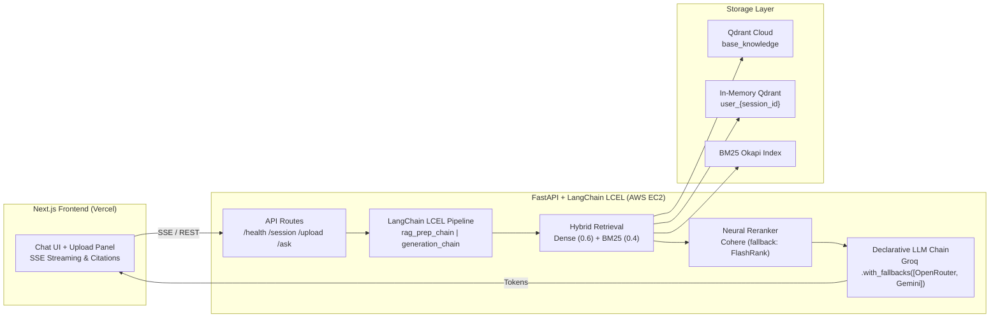

# Mini AI Knowledge System

**Live demo:** [https://miniaiknowledge.vercel.app](https://miniaiknowledge.vercel.app/)  


An advanced, intelligent document-powered RAG assistant built with pure LangChain LCEL. Answers questions grounded strictly in a set of documents — a curated base knowledge library plus anything a visitor uploads in their own session — with real-time streaming citations, while gracefully handling general conversational queries with an explicit `LLM Reply` badge.

---

## Key Features

- **Grounded Document Answers with Citations**: Cites claims with bracket citations `[1]`, `[2]` linking directly to file names, page numbers, and exact text excerpts.
- **LLM Reply for General Knowledge**: Answers general knowledge, greetings, and queries outside the knowledge base intelligently and marks them clearly as `LLM Reply`.
- **Preloaded Base Knowledge**: 6 curated, real-world documents covering Personal Finance, the Constitution of India, the Indian Economy, Climate Science, Health & Wellness, and Computer Science.
- **Ephemeral Session Uploads**: Users can drag and drop PDFs (up to 10MB) for isolated in-memory analysis during their session without cross-user data leaks.
- **Pure LangChain LCEL**: Built using declarative LangChain Expression Language (`RunnablePassthrough`, `RunnableLambda`, `.with_fallbacks()`, `StrOutputParser()`).
- **Resilient Multi-Provider Fallback**: Seamless fallback across Groq, OpenRouter, and Google Gemini with automatic rotation across configured keys.
- **Fast Hybrid Search**: Combines semantic vector similarity (FastEmbed + Qdrant Cloud), lexical search (BM25), and cross-encoder neural reranking (Cohere + FlashRank fallback).
- **Interactive Dark UI**: Built with Next.js, Tailwind CSS, an interactive canvas particle background, and real-time Server-Sent Events (SSE) streaming.

---

## Architecture & Methodology



### Two Knowledge Layers
1. **Base Knowledge Layer**: Pre-indexed documents permanently stored in Qdrant Cloud. Available to all users across all sessions.
2. **User Session Layer**: Documents uploaded by the visitor, indexed into an isolated in-memory Qdrant collection (`user_{session_id}`) and cleared when the session closes.

### Curated Base Knowledge Library (6 Documents)
- `Building_Wealth_Personal_Finance.pdf`: Guide to budgeting, saving, investing, debt, mortgages, and wealth creation.
- `Constitution_of_India.pdf`: Complete official text of the Constitution of India (Preamble, Fundamental Rights, Articles, Schedules).
- `India_Economic_Survey_Overview.pdf`: Government of India Economic Survey (GDP growth, macro-stability, agriculture, industry).
- `Health_and_Physical_Wellness_Guidelines.pdf`: Comprehensive physical activity, nutrition, and wellness guidelines.
- `UN_Climate_Change_Report_Summary.pdf`: IPCC AR6 climate science, global energy transition, and sustainability summary.
- `Think_Python.pdf`: Full textbook on computer science, algorithms, and Python programming.

---

## Tech Stack

| Layer | Technology | Role |
| :--- | :--- | :--- |
| **Orchestration** | **LangChain (LCEL)** | End-to-end `Runnable` pipelines, prompt templates, output parsers, and `.with_fallbacks()` model chaining. |
| **Backend Framework** | **FastAPI** | High-performance asynchronous REST and SSE streaming endpoints. |
| **Vector Database** | **Qdrant Cloud & In-Memory** | Persistent cloud storage for base knowledge + ephemeral RAM storage for user uploads. |
| **Embeddings** | **FastEmbed (BAAI/bge-base-en-v1.5)** | Fast, CPU-friendly open-weight text embeddings. |
| **Sparse Retrieval** | **BM25 (rank-bm25)** | Lexical keyword matching complementing dense vector search. |
| **Reranking** | **Cohere + FlashRank** | Primary neural cross-encoder reranker with automatic local FlashRank fallback. |
| **LLM Providers** | **Groq, OpenRouter, Gemini** | High-speed LLM inference with declarative automatic fallback. |
| **Frontend** | **Next.js 16 + React 18** | Dark modern interface with Tailwind CSS and particle canvas visuals. |
| **Backend Hosting** | **AWS EC2 (Ubuntu 24.04)** | Dedicated cloud server running systemd-managed Uvicorn backend. |
| **Frontend Hosting** | **Vercel** | Edge network deployment with server-side API proxying. |

---

## Running Locally

### Backend Setup
```bash
cd rag-assistant/backend
python -m venv venv
source venv/bin/activate  # On Windows: venv\Scripts\activate
pip install -r requirements.txt
uvicorn app.main:app --host 0.0.0.0 --port 8000 --reload
```

### Frontend Setup
```bash
cd rag-assistant/frontend
npm install
npm run dev
```

---

*Mini AI Knowledge System • Designed & Built by Sachin*
